# 4. Class diagram and flowcharts (Mermaid)

All names (classes, methods, variables, constants) are copied from the source code in `src/main/java/com/marketplace/products`.
The design brief requires the diagrams and the code to match, so a rename in the code is made here too.

**How to view:** paste any diagram block into <https://mermaid.live>, or use a Markdown preview with Mermaid support
(VS Code: "Markdown Preview Mermaid Support" extension; GitHub renders them automatically).
Each diagram can be exported as PNG/SVG from mermaid.live, or redrawn in draw.io or Figma if the
module expects the lecture-style flowchart symbols (see the note at the end).

Contents

1. [Class diagram (Products component)](#1-class-diagram-products-component)
2. [Group class diagram skeleton](#2-group-class-diagram-skeleton)
3. [Flowcharts: validation](#3-flowcharts-validation)
4. [Flowcharts: search and filter](#4-flowcharts-search-and-filter)
5. [Flowcharts: service operations](#5-flowcharts-service-operations)
6. [Flowcharts: images](#6-flowcharts-images)
7. [Flowcharts: database, IDs and seeding](#7-flowcharts-database-ids-and-seeding)
8. [Flowcharts: user interface logic](#8-flowcharts-user-interface-logic)
9. [Sequence diagram: threads](#9-sequence-diagram-which-thread-does-what)

---

## 1. Class diagram (Products component)

Products-component classes are coloured red (the design brief asks for the author's own component to be shown in red).
Only the important attributes and methods are listed; see the source for private helpers.

```mermaid
classDiagram
    direction TB

    class Product {
        -String id
        -String name
        -String description
        -BigDecimal price
        -int stockQuantity
        -boolean active
        -List~String~ categories
        -List~String~ imagePaths
        -Instant createdAt
        -Instant updatedAt
        +getStockLevel() StockLevel
        +isAvailableForSale() boolean
        +getFirstImagePath() String
    }
    class StockLevel {
        <<enumeration>>
        OUT_OF_STOCK
        LOW_STOCK
        IN_STOCK
        +LOW_STOCK_THRESHOLD int
        +fromQuantity(int quantity) StockLevel
    }
    class ProductForm {
        <<record>>
        +String name
        +String description
        +String priceText
        +String stockText
        +boolean active
        +List~String~ categories
        +List~String~ imagePaths
    }
    class ProductFilter {
        -String nameQuery
        -String category
        -BigDecimal minPrice
        -BigDecimal maxPrice
        -Availability availability
        -Status status
    }
    class Categories {
        +String[] DEFAULTS
        +MAX_NAME_LENGTH int
        +normalise(String raw) String
        +containsIgnoreCase(List categories, String name) boolean
        +cleanList(List rawCategories) List
    }
    class ProductValidator {
        +validate(ProductForm form) ValidationResult
        +validateName(String name) String
        +validateDescription(String description) String
        +validatePrice(String priceText) String
        +validateStock(String stockText) String
        +validateCategories(List categories) String
        +validateImageCount(List imagePaths) String
        +validatePriceRange(String minText, String maxText) ValidationResult
        +toPrice(String priceText) BigDecimal
        +toStock(String stockText) int
    }
    class ValidationResult {
        -Map errors
        +addError(String field, String message)
        +isValid() boolean
        +hasError(String field) boolean
        +getError(String field) String
        +getFirstErrorField() String
    }
    class ProductService {
        -ProductRepository repository
        -ImageStorageService imageStorage
        +search(ProductFilter filter) SearchResult
        +getAllProducts() List
        +getById(String productId) Product
        +addProduct(ProductForm form) Product
        +updateProduct(String productId, ProductForm form) Product
        +setActive(String productId, boolean active) Product
        +deleteProduct(String productId)
    }
    class ProductSearch {
        +filter(List products, ProductFilter filter) List
        +matches(Product product, ProductFilter filter) boolean
        +countByStockLevel(List products) int[]
        +collectCategories(List products) List
    }
    class SearchResult {
        <<record>>
        +List matches
        +int totalCount
        +int[] stockLevelCounts
        +List categories
    }
    class ProductRepository {
        <<interface>>
        +nextProductId() String
        +insert(Product product)
        +update(Product product) boolean
        +deleteById(String id) boolean
        +findById(String id) Optional
        +findAll() List
    }
    class MongoProductRepository {
        +ensureIndexes()
        +translate(MongoException e) DatabaseException
    }
    class ProductMapper {
        +toDocument(Product product) Document
        +fromDocument(Document document) Product
    }
    class ImageStorageService {
        +MAX_FILE_SIZE_BYTES long
        +String[] ALLOWED_EXTENSIONS
        +storeImage(Path source) String
        +validateImageFile(Path source)
        +resolve(String relativePath) Path
        +exists(String relativePath) boolean
        +deleteImage(String relativePath) boolean
    }
    class SampleDataSeeder {
        -SampleProduct[] SAMPLES
        +seed() SeedResult
    }
    class AppConfig {
        +load() AppConfig
        +getMongoUri() String
        +getDatabaseName() String
        +getDataDir() Path
    }
    class AppContext {
        +connect()
        +isConnected() boolean
        +getProductService() ProductService
        +getImageStorage() ImageStorageService
        +close()
    }
    class MainController {
        -int PAGE_SIZE
        -reloadProducts(String selectProductId)
        -showPage(String selectProductId)
        -openProductForm(Product existing)
        -closeProductForm(Product existing, Product saved)
        -buildFilter() ProductFilter
        -onToggleActive()
        -onDeleteProduct()
    }
    class ProductFormController {
        +load(AppContext, Product, List, Consumer) LoadedForm
        -onSave()
        -onAddImages()
        -removeImage(String imagePath)
    }
    class AsyncRunner {
        +run(Callable work, Consumer onSuccess, Consumer onFailure)
    }

    ProductService "1" --> "1" ProductRepository : stores via
    ProductService "1" --> "1" ImageStorageService : cleans up images
    ProductService ..> ProductValidator : validates with
    ProductService ..> ProductSearch : filters with
    ProductService ..> ProductForm : receives
    ProductService ..> SearchResult : returns
    ProductRepository "1" o-- "0..*" Product : persists
    MongoProductRepository ..|> ProductRepository
    MongoProductRepository ..> ProductMapper : converts with
    ProductValidator ..> ValidationResult : returns
    ProductValidator ..> Categories : uses
    ProductSearch ..> ProductFilter : reads
    Product ..> StockLevel : getStockLevel
    AppContext "1" --> "1" ProductService : creates
    AppContext "1" --> "1" ImageStorageService : creates
    AppContext "1" --> "1" AppConfig : reads
    SampleDataSeeder ..> ProductService : adds through
    SampleDataSeeder ..> ImageStorageService : stores images with
    MainController "1" --> "1" AppContext : uses
    ProductFormController "1" --> "1" AppContext : uses
    MainController ..> ProductFormController : opens
    MainController ..> AsyncRunner : background work
    ProductFormController ..> AsyncRunner : background work

    style Product fill:#fecaca,stroke:#dc2626,stroke-width:2px,color:#000
    style StockLevel fill:#fecaca,stroke:#dc2626,stroke-width:2px,color:#000
    style ProductForm fill:#fecaca,stroke:#dc2626,stroke-width:2px,color:#000
    style ProductFilter fill:#fecaca,stroke:#dc2626,stroke-width:2px,color:#000
    style Categories fill:#fecaca,stroke:#dc2626,stroke-width:2px,color:#000
    style ProductValidator fill:#fecaca,stroke:#dc2626,stroke-width:2px,color:#000
    style ValidationResult fill:#fecaca,stroke:#dc2626,stroke-width:2px,color:#000
    style ProductService fill:#fecaca,stroke:#dc2626,stroke-width:2px,color:#000
    style ProductSearch fill:#fecaca,stroke:#dc2626,stroke-width:2px,color:#000
    style SearchResult fill:#fecaca,stroke:#dc2626,stroke-width:2px,color:#000
    style ProductRepository fill:#fecaca,stroke:#dc2626,stroke-width:2px,color:#000
    style MongoProductRepository fill:#fecaca,stroke:#dc2626,stroke-width:2px,color:#000
    style ProductMapper fill:#fecaca,stroke:#dc2626,stroke-width:2px,color:#000
    style ImageStorageService fill:#fecaca,stroke:#dc2626,stroke-width:2px,color:#000
    style SampleDataSeeder fill:#fecaca,stroke:#dc2626,stroke-width:2px,color:#000
    style AppConfig fill:#fecaca,stroke:#dc2626,stroke-width:2px,color:#000
    style AppContext fill:#fecaca,stroke:#dc2626,stroke-width:2px,color:#000
    style MainController fill:#fecaca,stroke:#dc2626,stroke-width:2px,color:#000
    style ProductFormController fill:#fecaca,stroke:#dc2626,stroke-width:2px,color:#000
    style AsyncRunner fill:#fecaca,stroke:#dc2626,stroke-width:2px,color:#000
```

---

## 2. Group class diagram skeleton

The brief asks for a **group** diagram showing how each component links to the others, with the Products classes in red.
The skeleton below shows the **one link every other component needs from Products: the product ID**.
`Order line`, `Review` and `Warehouse stock` stand for classes owned by the other components; their names, attributes and multiplicities are fixed by `docs/SHARED-CONVENTIONS.md` at the repository root.

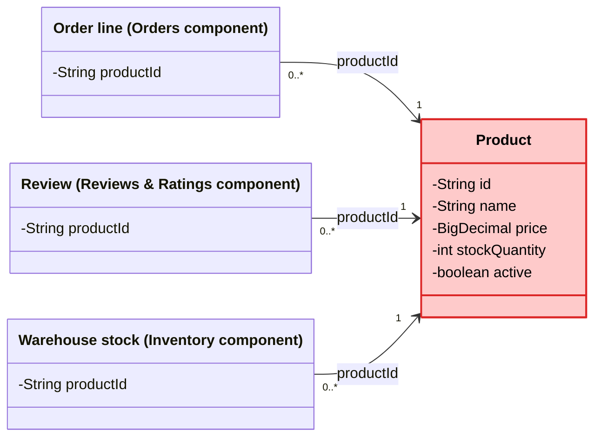
```mermaid
classDiagram
    direction LR
    class Product {
        -String id
        -String name
        -BigDecimal price
        -int stockQuantity
        -boolean active
    }
    class OrderLine["Order line (Orders component)"] {
        -String productId
    }
    class Review["Review (Reviews & Ratings component)"] {
        -String productId
    }
    class WarehouseStock["Warehouse stock (Inventory component)"] {
        -String productId
    }

    OrderLine "0..*" --> "1" Product : productId
    Review "0..*" --> "1" Product : productId
    WarehouseStock "0..*" --> "1" Product : productId

    style Product fill:#fecaca,stroke:#dc2626,stroke-width:2px,color:#000
```

---

## 3. Flowcharts: validation

### `ProductValidator.validateName(String name)`

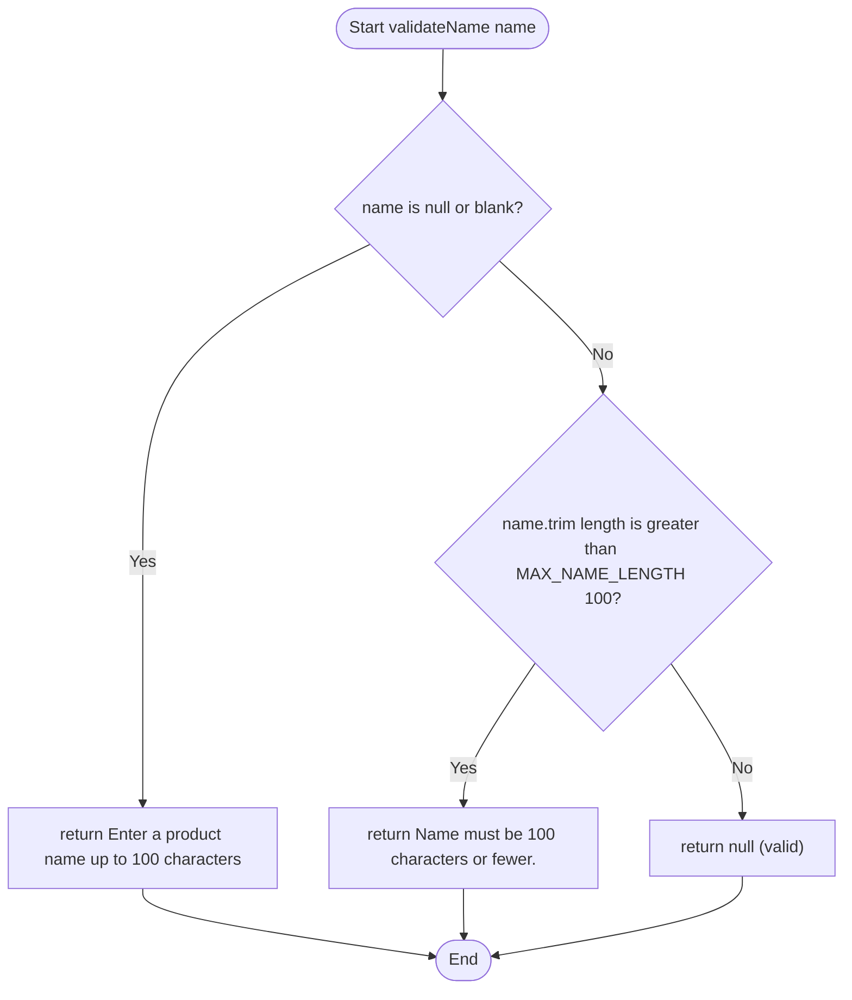
```mermaid
flowchart TD
    A([Start validateName name]) --> B{"name is null or blank?"}
    B -- Yes --> C["return Enter a product name up to 100 characters"]
    B -- No --> D{"name.trim length is greater than MAX_NAME_LENGTH 100?"}
    D -- Yes --> E["return Name must be 100 characters or fewer."]
    D -- No --> F["return null (valid)"]
    C --> Z([End])
    E --> Z
    F --> Z
```

### `ProductValidator.validatePrice(String priceText)`

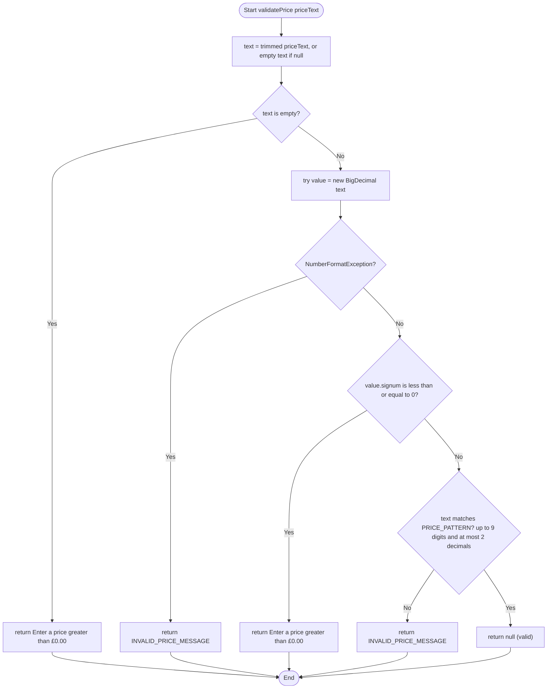
```mermaid
flowchart TD
    A([Start validatePrice priceText]) --> B["text = trimmed priceText, or empty text if null"]
    B --> C{"text is empty?"}
    C -- Yes --> C1["return Enter a price greater than £0.00"]
    C -- No --> D["try value = new BigDecimal text"]
    D --> E{"NumberFormatException?"}
    E -- Yes --> E1["return INVALID_PRICE_MESSAGE"]
    E -- No --> F{"value.signum is less than or equal to 0?"}
    F -- Yes --> F1["return Enter a price greater than £0.00"]
    F -- No --> G{"text matches PRICE_PATTERN? up to 9 digits and at most 2 decimals"}
    G -- No --> G1["return INVALID_PRICE_MESSAGE"]
    G -- Yes --> H["return null (valid)"]
    C1 --> Z([End])
    E1 --> Z
    F1 --> Z
    G1 --> Z
    H --> Z
```

### `ProductValidator.validateStock(String stockText)`

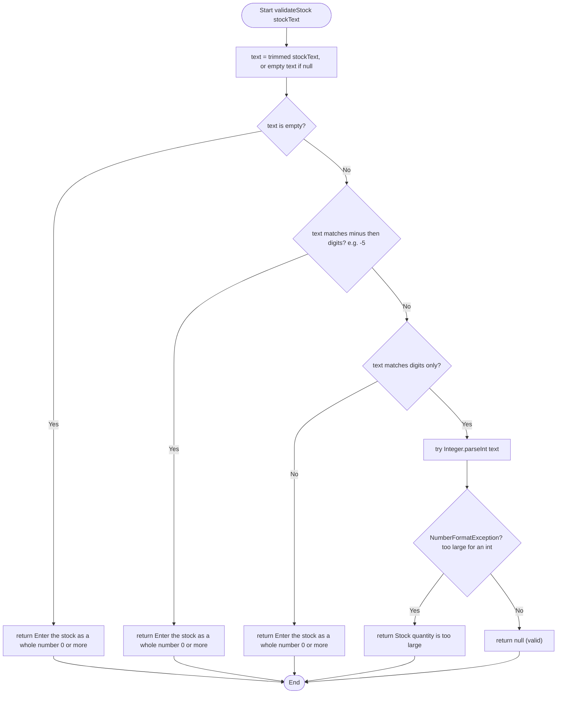
```mermaid
flowchart TD
    A([Start validateStock stockText]) --> B["text = trimmed stockText, or empty text if null"]
    B --> C{"text is empty?"}
    C -- Yes --> C1["return Enter the stock as a whole number 0 or more"]
    C -- No --> D{"text matches minus then digits? e.g. -5"}
    D -- Yes --> D1["return Enter the stock as a whole number 0 or more"]
    D -- No --> E{"text matches digits only?"}
    E -- No --> E1["return Enter the stock as a whole number 0 or more"]
    E -- Yes --> F["try Integer.parseInt text"]
    F --> G{"NumberFormatException? too large for an int"}
    G -- Yes --> G1["return Stock quantity is too large"]
    G -- No --> H["return null (valid)"]
    C1 --> Z([End])
    D1 --> Z
    E1 --> Z
    G1 --> Z
    H --> Z
```

### `ProductValidator.validate(ProductForm form)`

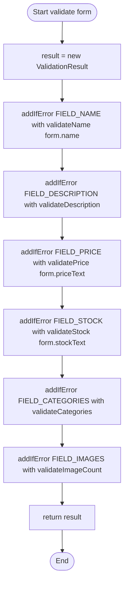
```mermaid
flowchart TD
    A([Start validate form]) --> B["result = new ValidationResult"]
    B --> C["addIfError FIELD_NAME with validateName form.name"]
    C --> D["addIfError FIELD_DESCRIPTION with validateDescription"]
    D --> E["addIfError FIELD_PRICE with validatePrice form.priceText"]
    E --> F["addIfError FIELD_STOCK with validateStock form.stockText"]
    F --> G["addIfError FIELD_CATEGORIES with validateCategories"]
    G --> H["addIfError FIELD_IMAGES with validateImageCount"]
    H --> I["return result"]
    I --> Z([End])
```

`addIfError(result, field, message)` only calls `result.addError(field, message)` when `message` is not null.
`result.isValid()` is true when no errors were added.

### `ProductValidator.validatePriceRange(String minText, String maxText)` (search-bar price boxes)

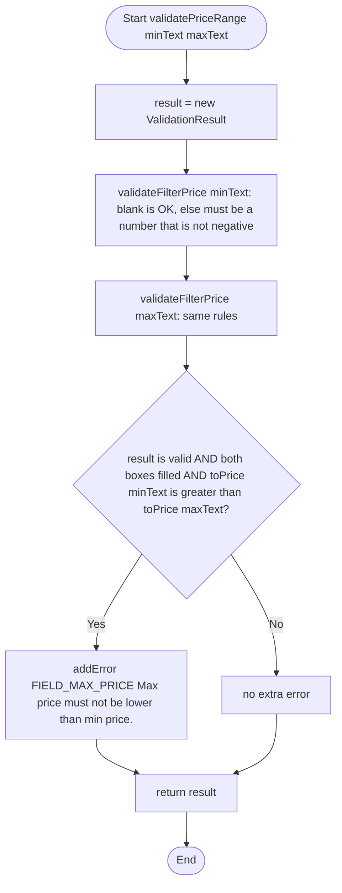
```mermaid
flowchart TD
    A([Start validatePriceRange minText maxText]) --> B["result = new ValidationResult"]
    B --> C["validateFilterPrice minText: blank is OK, else must be a number that is not negative"]
    C --> D["validateFilterPrice maxText: same rules"]
    D --> E{"result is valid AND both boxes filled AND toPrice minText is greater than toPrice maxText?"}
    E -- Yes --> F["addError FIELD_MAX_PRICE Max price must not be lower than min price."]
    E -- No --> G["no extra error"]
    F --> H["return result"]
    G --> H
    H --> Z([End])
```

---

## 4. Flowcharts: search and filter

### `ProductSearch.filter(List products, ProductFilter filter)`

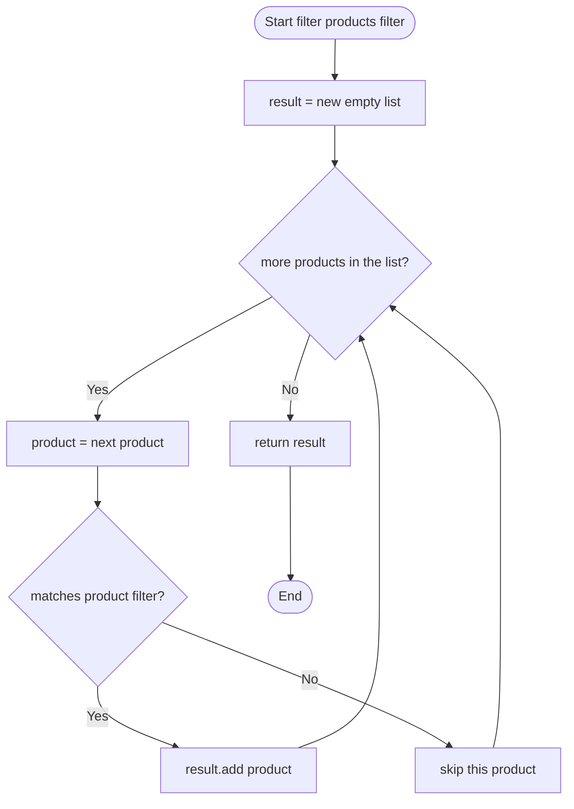
```mermaid
flowchart TD
    A([Start filter products filter]) --> B["result = new empty list"]
    B --> C{"more products in the list?"}
    C -- No --> H["return result"]
    C -- Yes --> D["product = next product"]
    D --> E{"matches product filter?"}
    E -- Yes --> F["result.add product"]
    E -- No --> G["skip this product"]
    F --> C
    G --> C
    H --> Z([End])
```

### `ProductSearch.matches(Product product, ProductFilter filter)`

Every active filter must pass (logical AND). The first failing check returns false immediately.

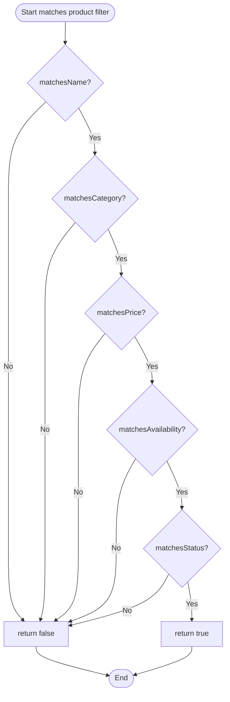
```mermaid
flowchart TD
    A([Start matches product filter]) --> B{"matchesName?"}
    B -- No --> X["return false"]
    B -- Yes --> C{"matchesCategory?"}
    C -- No --> X
    C -- Yes --> D{"matchesPrice?"}
    D -- No --> X
    D -- Yes --> E{"matchesAvailability?"}
    E -- No --> X
    E -- Yes --> F{"matchesStatus?"}
    F -- No --> X
    F -- Yes --> Y["return true"]
    X --> Z([End])
    Y --> Z
```

### `matchesName`, `matchesCategory`, `matchesPrice` (the helper checks)

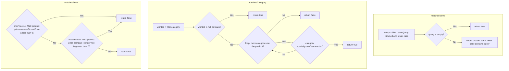
```mermaid
flowchart TD
    subgraph matchesName
        N1["query = filter.nameQuery trimmed and lower case"] --> N2{"query is empty?"}
        N2 -- Yes --> N3["return true"]
        N2 -- No --> N4["return product name lower case contains query"]
    end
    subgraph matchesCategory
        C1["wanted = filter.category"] --> C2{"wanted is null or blank?"}
        C2 -- Yes --> C3["return true"]
        C2 -- No --> C4{"loop: more categories on the product?"}
        C4 -- No --> C5["return false"]
        C4 -- Yes --> C6{"category equalsIgnoreCase wanted?"}
        C6 -- Yes --> C7["return true"]
        C6 -- No --> C4
    end
    subgraph matchesPrice
        P1{"minPrice set AND product price compareTo minPrice is less than 0?"} -- Yes --> P2["return false"]
        P1 -- No --> P3{"maxPrice set AND product price compareTo maxPrice is greater than 0?"}
        P3 -- Yes --> P2
        P3 -- No --> P4["return true"]
    end
```

### `ProductSearch.countByStockLevel(List products)`

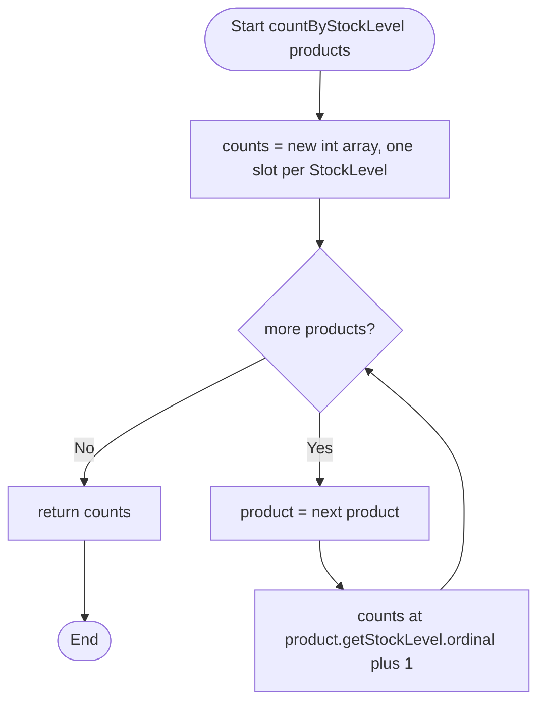
```mermaid
flowchart TD
    A([Start countByStockLevel products]) --> B["counts = new int array, one slot per StockLevel"]
    B --> C{"more products?"}
    C -- No --> F["return counts"]
    C -- Yes --> D["product = next product"]
    D --> E["counts at product.getStockLevel.ordinal plus 1"]
    E --> C
    F --> Z([End])
```

---

## 5. Flowcharts: service operations

### `ProductService.search(ProductFilter filter)`

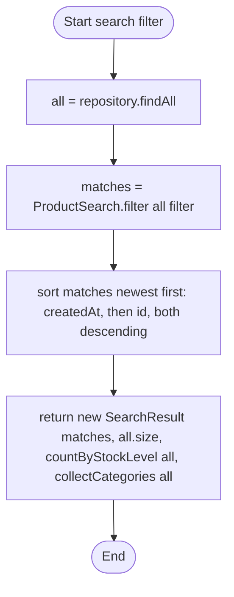
```mermaid
flowchart TD
    A([Start search filter]) --> B["all = repository.findAll"]
    B --> C["matches = ProductSearch.filter all filter"]
    C --> D["sort matches newest first: createdAt, then id, both descending"]
    D --> E["return new SearchResult matches, all.size, countByStockLevel all, collectCategories all"]
    E --> Z([End])
```

### `ProductService.addProduct(ProductForm form)`

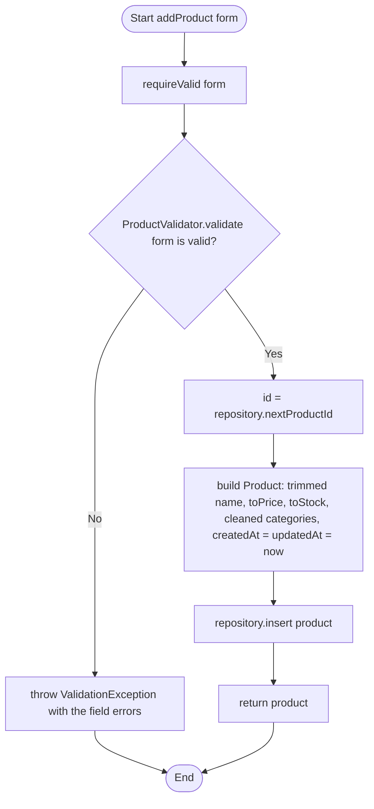
```mermaid
flowchart TD
    A([Start addProduct form]) --> B["requireValid form"]
    B --> C{"ProductValidator.validate form is valid?"}
    C -- No --> D["throw ValidationException with the field errors"]
    C -- Yes --> E["id = repository.nextProductId"]
    E --> F["build Product: trimmed name, toPrice, toStock, cleaned categories, createdAt = updatedAt = now"]
    F --> G["repository.insert product"]
    G --> H["return product"]
    D --> Z([End])
    H --> Z
```

The ID is requested **after** validation, so a rejected form never uses up an ID.

### `ProductService.updateProduct(String productId, ProductForm form)`

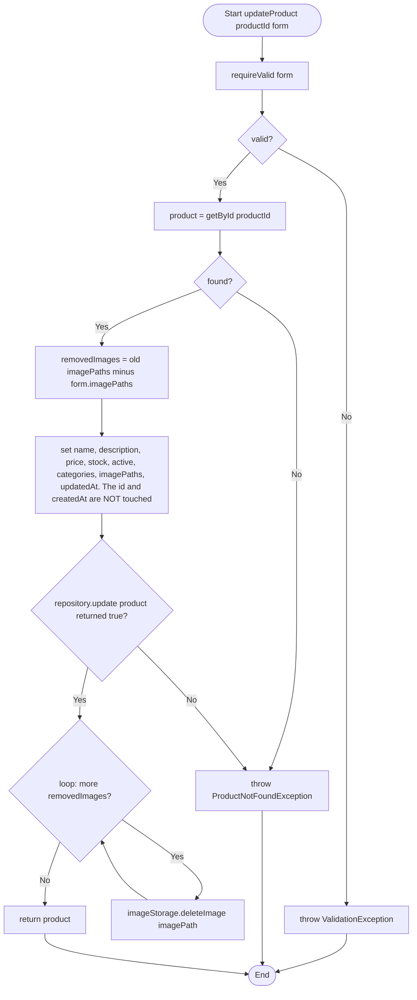
```mermaid
flowchart TD
    A([Start updateProduct productId form]) --> B["requireValid form"]
    B --> C{"valid?"}
    C -- No --> D["throw ValidationException"]
    C -- Yes --> E["product = getById productId"]
    E --> F{"found?"}
    F -- No --> G["throw ProductNotFoundException"]
    F -- Yes --> H["removedImages = old imagePaths minus form.imagePaths"]
    H --> I["set name, description, price, stock, active, categories, imagePaths, updatedAt. The id and createdAt are NOT touched"]
    I --> J{"repository.update product returned true?"}
    J -- No --> G
    J -- Yes --> K{"loop: more removedImages?"}
    K -- Yes --> L["imageStorage.deleteImage imagePath"]
    L --> K
    K -- No --> M["return product"]
    D --> Z([End])
    G --> Z
    M --> Z
```

### `ProductService.setActive(String productId, boolean active)` (deactivate / activate)

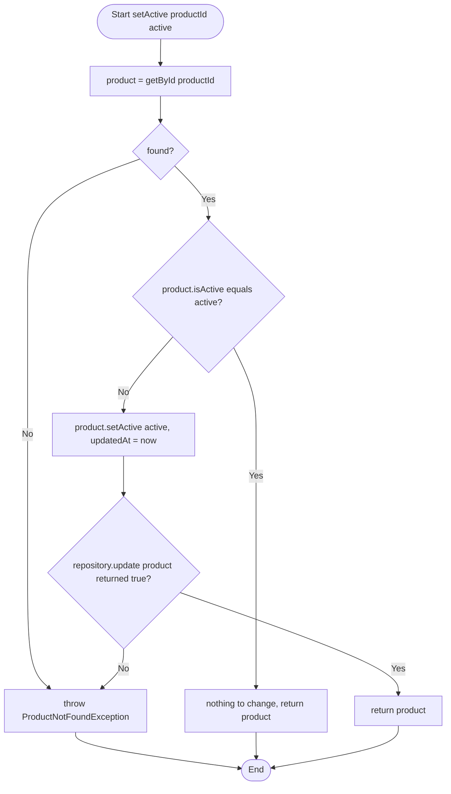
```mermaid
flowchart TD
    A([Start setActive productId active]) --> B["product = getById productId"]
    B --> C{"found?"}
    C -- No --> D["throw ProductNotFoundException"]
    C -- Yes --> E{"product.isActive equals active?"}
    E -- Yes --> F["nothing to change, return product"]
    E -- No --> G["product.setActive active, updatedAt = now"]
    G --> H{"repository.update product returned true?"}
    H -- No --> D
    H -- Yes --> I["return product"]
    D --> Z([End])
    F --> Z
    I --> Z
```

### `ProductService.deleteProduct(String productId)`

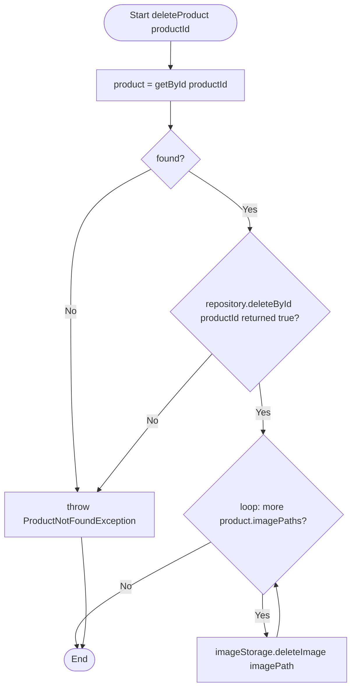
```mermaid
flowchart TD
    A([Start deleteProduct productId]) --> B["product = getById productId"]
    B --> C{"found?"}
    C -- No --> D["throw ProductNotFoundException"]
    C -- Yes --> E{"repository.deleteById productId returned true?"}
    E -- No --> D
    E -- Yes --> F{"loop: more product.imagePaths?"}
    F -- Yes --> G["imageStorage.deleteImage imagePath"]
    G --> F
    F -- No --> H([End])
    D --> H
```

The confirmation dialogue is shown by `MainController.onDeleteProduct` **before** this method is called.

---

## 6. Flowcharts: images

### `ImageStorageService.storeImage(Path source)` (includes `checkAndDetectFormat`)

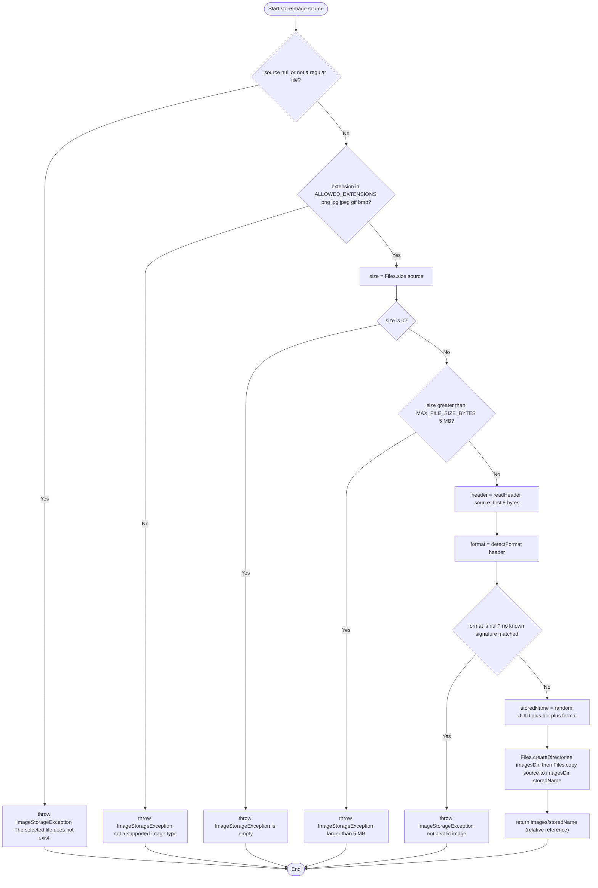
```mermaid
flowchart TD
    A([Start storeImage source]) --> B{"source null or not a regular file?"}
    B -- Yes --> B1["throw ImageStorageException The selected file does not exist."]
    B -- No --> C{"extension in ALLOWED_EXTENSIONS png jpg jpeg gif bmp?"}
    C -- No --> C1["throw ImageStorageException not a supported image type"]
    C -- Yes --> D["size = Files.size source"]
    D --> E{"size is 0?"}
    E -- Yes --> E1["throw ImageStorageException is empty"]
    E -- No --> F{"size greater than MAX_FILE_SIZE_BYTES 5 MB?"}
    F -- Yes --> F1["throw ImageStorageException larger than 5 MB"]
    F -- No --> G["header = readHeader source: first 8 bytes"]
    G --> H["format = detectFormat header"]
    H --> I{"format is null? no known signature matched"}
    I -- Yes --> I1["throw ImageStorageException not a valid image"]
    I -- No --> J["storedName = random UUID plus dot plus format"]
    J --> K["Files.createDirectories imagesDir, then Files.copy source to imagesDir storedName"]
    K --> L["return images/storedName (relative reference)"]
    B1 --> Z([End])
    C1 --> Z
    E1 --> Z
    F1 --> Z
    I1 --> Z
    L --> Z
```

### `ImageStorageService.detectFormat(byte[] header)`

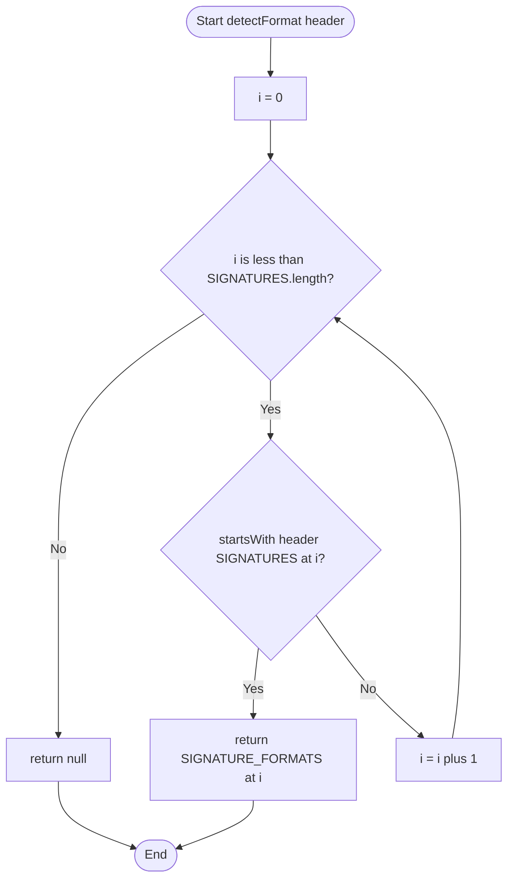
```mermaid
flowchart TD
    A([Start detectFormat header]) --> B["i = 0"]
    B --> C{"i is less than SIGNATURES.length?"}
    C -- No --> D["return null"]
    C -- Yes --> E{"startsWith header SIGNATURES at i?"}
    E -- Yes --> F["return SIGNATURE_FORMATS at i"]
    E -- No --> G["i = i plus 1"]
    G --> C
    D --> Z([End])
    F --> Z
```

### `ImageStorageService.resolve(String relativePath)`

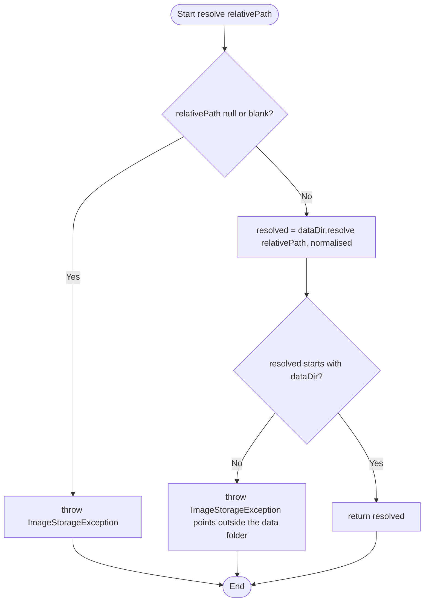
```mermaid
flowchart TD
    A([Start resolve relativePath]) --> B{"relativePath null or blank?"}
    B -- Yes --> B1["throw ImageStorageException"]
    B -- No --> C["resolved = dataDir.resolve relativePath, normalised"]
    C --> D{"resolved starts with dataDir?"}
    D -- No --> D1["throw ImageStorageException points outside the data folder"]
    D -- Yes --> E["return resolved"]
    B1 --> Z([End])
    D1 --> Z
    E --> Z
```

### `ProductFormController.onAddImages()` and `importImages(...)`

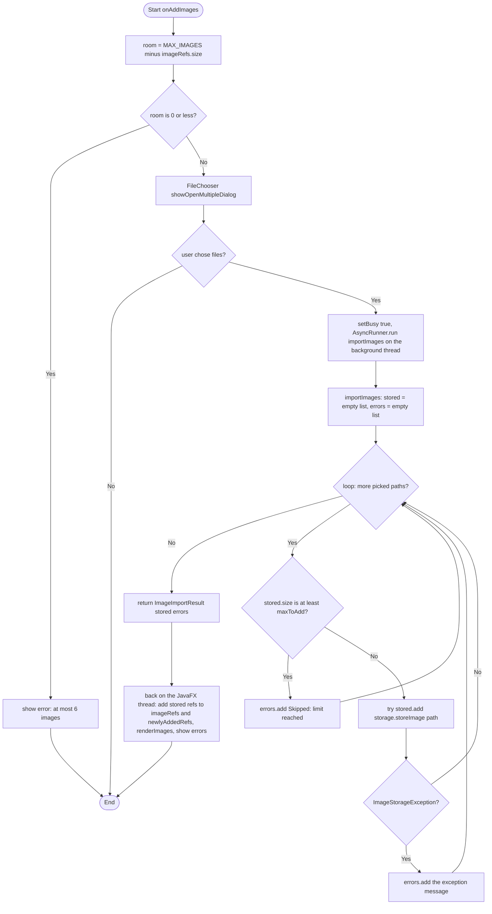
```mermaid
flowchart TD
    A([Start onAddImages]) --> B["room = MAX_IMAGES minus imageRefs.size"]
    B --> C{"room is 0 or less?"}
    C -- Yes --> C1["show error: at most 6 images"]
    C -- No --> D["FileChooser showOpenMultipleDialog"]
    D --> E{"user chose files?"}
    E -- No --> Z([End])
    E -- Yes --> F["setBusy true, AsyncRunner.run importImages on the background thread"]
    F --> G["importImages: stored = empty list, errors = empty list"]
    G --> H{"loop: more picked paths?"}
    H -- No --> N["return ImageImportResult stored errors"]
    H -- Yes --> I{"stored.size is at least maxToAdd?"}
    I -- Yes --> J["errors.add Skipped: limit reached"]
    I -- No --> K["try stored.add storage.storeImage path"]
    K --> L{"ImageStorageException?"}
    L -- Yes --> M["errors.add the exception message"]
    L -- No --> H
    J --> H
    M --> H
    N --> O["back on the JavaFX thread: add stored refs to imageRefs and newlyAddedRefs, renderImages, show errors"]
    C1 --> Z
    O --> Z
```

---

## 7. Flowcharts: database, IDs and seeding

### `AppContext.connect()`

```mermaid
flowchart TD
    A([Start connect]) --> B["closeClient: drop any old connection"]
    B --> C["build MongoClientSettings from AppConfig.getMongoUri with 3 second timeouts"]
    C --> D["client = MongoClients.create settings"]
    D --> E["database.runCommand ping"]
    E --> F{"MongoException or IllegalArgumentException?"}
    F -- Yes --> G["closeQuietly client, throw DatabaseException with a message that says what to do"]
    F -- No --> H["repository = new MongoProductRepository database, repository.ensureIndexes"]
    H --> I["productService = new ProductService repository imageStorage"]
    I --> Z([End])
    G --> Z
```

If MongoDB is not available the method throws; the application never switches to an in-memory database.

### `MongoProductRepository.nextProductId()`

```mermaid
flowchart TD
    A([Start nextProductId]) --> B["counters.findOneAndUpdate id products, inc seq by 1, upsert true, return the NEW document"]
    B --> C["sequence = seq as a long"]
    C --> D["return PRD- plus sequence padded to 5 digits e.g. PRD-00007"]
    D --> Z([End])
```

MongoDB performs the increment atomically, so two users can never receive the same number.

### `SampleDataSeeder.seed()` (idempotent seed)

```mermaid
flowchart TD
    A([Start seed]) --> B["existingNames = lower case names of all products already saved"]
    B --> C["added = 0, skipped = 0, create temp folder"]
    C --> D["i = 0"]
    D --> E{"i is less than SAMPLES.length?"}
    E -- No --> J["delete temp folder, return SeedResult added skipped"]
    E -- Yes --> F{"existingNames contains SAMPLES at i name?"}
    F -- Yes --> G["skipped = skipped plus 1"]
    F -- No --> H["addSample: copy the sample photo from sample-images (or draw a placeholder if missing), storeImage, productService.addProduct"]
    H --> I["added = added plus 1"]
    G --> K["i = i plus 1"]
    I --> K
    K --> E
    J --> Z([End])
```

---

## 8. Flowcharts: user interface logic

### `MainController.reloadProducts(String selectProductId)`

```mermaid
flowchart TD
    A([Start reloadProducts selectProductId]) --> B{"connected?"}
    B -- No --> Z([End])
    B -- Yes --> C["filter = buildFilter"]
    C --> D{"filter is null? invalid price box"}
    D -- Yes --> Z
    D -- No --> E["ticket = searchTicket plus 1, beginBusy"]
    E --> F["AsyncRunner.run productService.search filter on the background thread"]
    F --> G["back on the JavaFX thread: endBusy"]
    G --> H{"ticket still equals searchTicket? not out of date"}
    H -- No --> Z
    H -- Yes --> I["applyResult: keep matches newest first, choose EMPTY / NO_MATCH / TABLE view, update summary, showPage: 8 rows, page that holds the product"]
    F -. exception .-> J["handleFailure"]
    I --> Z
    J --> Z
```

### `MainController.buildFilter()`

```mermaid
flowchart TD
    A([Start buildFilter]) --> B["range = ProductValidator.validatePriceRange min box, max box"]
    B --> C["showPriceFilterErrors range"]
    C --> D{"range.isValid?"}
    D -- No --> E["return null"]
    D -- Yes --> F["filter = new ProductFilter withNameQuery search box"]
    F --> G{"category chosen and not All categories?"}
    G -- Yes --> H["filter.withCategory category"]
    G -- No --> I["no category limit"]
    H --> J{"min box filled?"}
    I --> J
    J -- Yes --> K["filter.withMinPrice new BigDecimal text"]
    J -- No --> L{"max box filled?"}
    K --> L
    L -- Yes --> M["filter.withMaxPrice new BigDecimal text"]
    L -- No --> N["add availability and status, return filter"]
    M --> N
    E --> Z([End])
    N --> Z
```

### `ProductFormController.onSave()`

```mermaid
flowchart TD
    A([Start onSave]) --> B["form = readForm: name, description, price text, stock text, categories, imageRefs"]
    B --> C["result = ProductValidator.validate form"]
    C --> D["showValidation result: message under each bad field, red outline"]
    D --> E{"result.isValid?"}
    E -- No --> F["banner: Please fix N problems before saving, focusField result.getFirstErrorField"]
    E -- Yes --> G["setBusy true, AsyncRunner.run on the background thread"]
    G --> H{"existing product is null?"}
    H -- Yes --> I["productService.addProduct form"]
    H -- No --> J["productService.updateProduct existingId form"]
    I --> K{"succeeded?"}
    J --> K
    K -- Yes --> L["close product: MainController puts the catalogue back and shows the toast"]
    K -- No --> M["onSaveFailed: setBusy false, show field errors or a form-level message"]
    F --> Z([End])
    L --> Z
    M --> Z
```

### `MainController.onDeleteProduct()` (confirmation before a destructive action)

```mermaid
flowchart TD
    A([Start onDeleteProduct]) --> B{"a product is selected?"}
    B -- No --> Z([End])
    B -- Yes --> C["Dialogs.confirmDelete shows the Delete product / Cancel dialogue"]
    C --> D{"user chose Delete product?"}
    D -- No --> Z
    D -- Yes --> E["beginBusy, AsyncRunner.run productService.deleteProduct productId"]
    E --> F{"succeeded?"}
    F -- Yes --> G["clear selection, show success message, reloadProducts"]
    F -- No --> H["handleFailure"]
    G --> Z
    H --> Z
```

### `MainController.handleFailure(Throwable error)`

```mermaid
flowchart TD
    A([Start handleFailure error]) --> B{"error is a DatabaseException?"}
    B -- Yes --> C["connected = false, show the database error panel with Retry connection, error toast"]
    B -- No --> D{"error is a ProductNotFoundException?"}
    D -- Yes --> E["show message, reloadProducts"]
    D -- No --> F{"error is a ValidationException?"}
    F -- Yes --> G["show message with the invalid fields"]
    F -- No --> H["print stack trace, show Unexpected error message"]
    C --> Z([End])
    E --> Z
    G --> Z
    H --> Z
```

---

## 9. Sequence diagram: which thread does what

The window must never freeze while MongoDB or the disk is busy, so slow work runs on a background thread
(`AsyncRunner`) and only the result handlers touch the screen.

```mermaid
sequenceDiagram
    participant U as User
    participant FX as JavaFX thread (MainController)
    participant W as Worker thread (AsyncRunner)
    participant S as ProductService
    participant DB as MongoDB

    U->>FX: types in the search box (waits 300 ms)
    FX->>FX: buildFilter validates the price boxes
    FX->>W: AsyncRunner.run search filter
    Note over FX: window stays responsive
    W->>S: search filter
    S->>DB: findAll
    DB-->>S: documents
    S-->>W: SearchResult
    W-->>FX: onSucceeded handler runs on the JavaFX thread
    FX->>FX: applyResult updates the table, summary and details
    FX-->>U: new list is shown
```

---

### Note on flowchart style

The brief says flowcharts "should follow the same structure and style as presented in lectures".
The diagrams above use standard flowchart symbols (rounded = start/end, diamond = decision, rectangle = process).
If the lecture slides use a different convention (for example specific input/output shapes or numbered steps),
these are redrawn in that style. The logic and the names are what matter, and they match the code.
